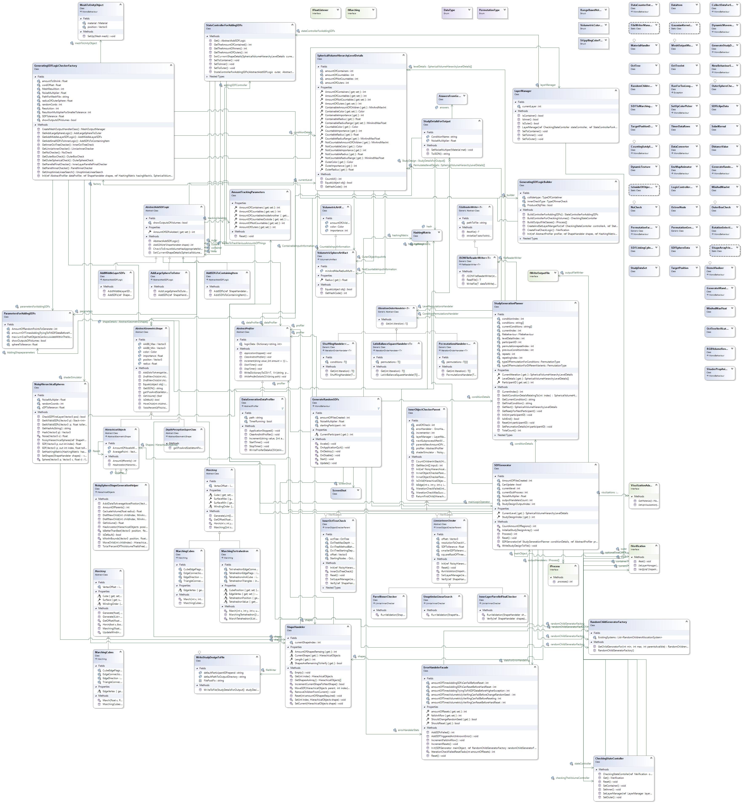

# Randomly Generating Volumes for HCI Research
A system designed to generate volumes randomly for research purposes. The paper describing it can be found at [10.1109/ISMAR-Adjunct60411.2023.00061](https://doi.org/10.1109/ISMAR-Adjunct60411.2023.00061) and was presented at ISMAR under the title "Generating Pseudo Random Volumes for Volumetric Research."

This system presents a modular approach to creating volumes randomly, tailored for Human-Computer Interaction (HCI) studies, particularly in Augmented Reality (AR) and Virtual Reality (VR) research, although it is not limited to these domains. Example code for rendering these objects is provided.

## Outputs
- **JSON Data**: Various outputs are achievable using this system. You can directly generate JSON code that facilitates user studies creation, incorporating visualization data and various answer data.
- **Interfaces**: The system includes two interfaces (desktop and Mixed Reality) intended to provide a template for conducting studies.
- **Modularity**: The entire system is designed with modularity in mind, providing flexibility for different research needs.

## System Design
This system utilizes a highly modular and adaptable modular system. Using an array of Design Patterns with a lot of inheritance. Below is an image of the main functioning class diagram showing the parts of the system that persist throughout iterations of the system.


## Architecture

The `Assets/Scripts/` folder is organised into the following subsystems:

### `SDFGenerationLogic/`
Core generation pipeline. Contains the top-level `SDFGenerator` orchestrator, the `GeneratingSDFLogicBuilder` (Builder pattern), `GeneratingSDFLogicCheckerFactory` (Factory pattern), and `LayerManager` (which synchronises the two state machines). The three-phase pipeline is: **add shapes** → **verify shapes** → **optional final check**.

### `SDFGenerationLogic/GeometricShapes/`
SDF shape class hierarchy. `AbstractGeometricShape` is the base; `HierarchicalObjects` extends it with parent/child relationships; `NoisySphereShapeGenerationHelper` is the concrete spherical shape with random child placement.

### `SDFGenerationLogic/AddingSDFs/`
Strategy classes for placing shapes at each layer. `StateControllerForAddingSDFs` is the State-pattern controller that switches between `AddLargeSphereToOuter`, `AddMiddleLayerSDFs`, and `AddSDFsToContainingItem` as the layer changes.

### `SDFGenerationLogic/Verification/`
Strategy classes for validating shape placement. `CheckingStateController` switches between outer-check and inner-check strategies. Inner checks include a linear voxel scan, a parallel voxel scan, and an oct-tree accelerated version.

### `SDFGenerationLogic/StudyOrganisation/`
Latin-square and permutation-based condition ordering. `StudyGenerationPlanner` uses an `IterationOrderHandler<T>` strategy (`LatinBalanceSquareHandler`, `PermutationsHandler`, or `ShufflingHandler`) to balance conditions across participants.

### `SDFGenerationLogic/HLSL_Simulator/`
C# re-implementation of the shader SDF maths for CPU-side verification. `NoisyHierarchicalSpheres` mirrors the HLSL SDF evaluation, enabling the verification pass to use the same logic as the GPU renderer.

### `SDFGenerationLogic/ResultsFromGeneration/`
Output data structures and JSON writing. `StudyDetailsForOutput` holds per-condition results; `WriteStudyDesignToFile` serialises a completed participant's `StudyDataSet` to a `.json` file.

### `GeneralHelperClasses/`
Reusable data structures and file I/O utilities, including an oct-tree implementation, `MinAndMaxFloat`/`MinAndMaxInt` helpers, and JSON/CSV file reader-writers.

### `MonoBehaviours/`
Unity entry points. `GenerateRandomSDFs` drives the generation loop each frame. `CountingStudySDFManager` and `DemoVisualizer` are the two visualization adapters that push the generated shape data to the material shader.


If you use or modify this system, please cite or link to the relevant research paper (10.1109/ISMAR-Adjunct60411.2023.00061), the BibTeX entry provided below, or link to this repository.

### Bibtex
```
@INPROCEEDINGS{10322203,
  author={Clarke, Thomas J. and Mayer, Wolfgang and Zucco, Joanne E. and Smith, Ross T.},
  booktitle={2023 IEEE International Symposium on Mixed and Augmented Reality Adjunct (ISMAR-Adjunct)}, 
  title={Generating Pseudo Random Volumes for Volumetric Research}, 
  year={2023},
  volume={},
  number={},
  pages={266-270},
  keywords={Headphones;Three-dimensional displays;Design methodology;Mixed reality;User interfaces;Augmented reality;Meteorology;Human-centered computing;Visualization;Visualization techniques;Treemaps;Visualization design and evaluation methods},
  doi={10.1109/ISMAR-Adjunct60411.2023.00061}}
```
