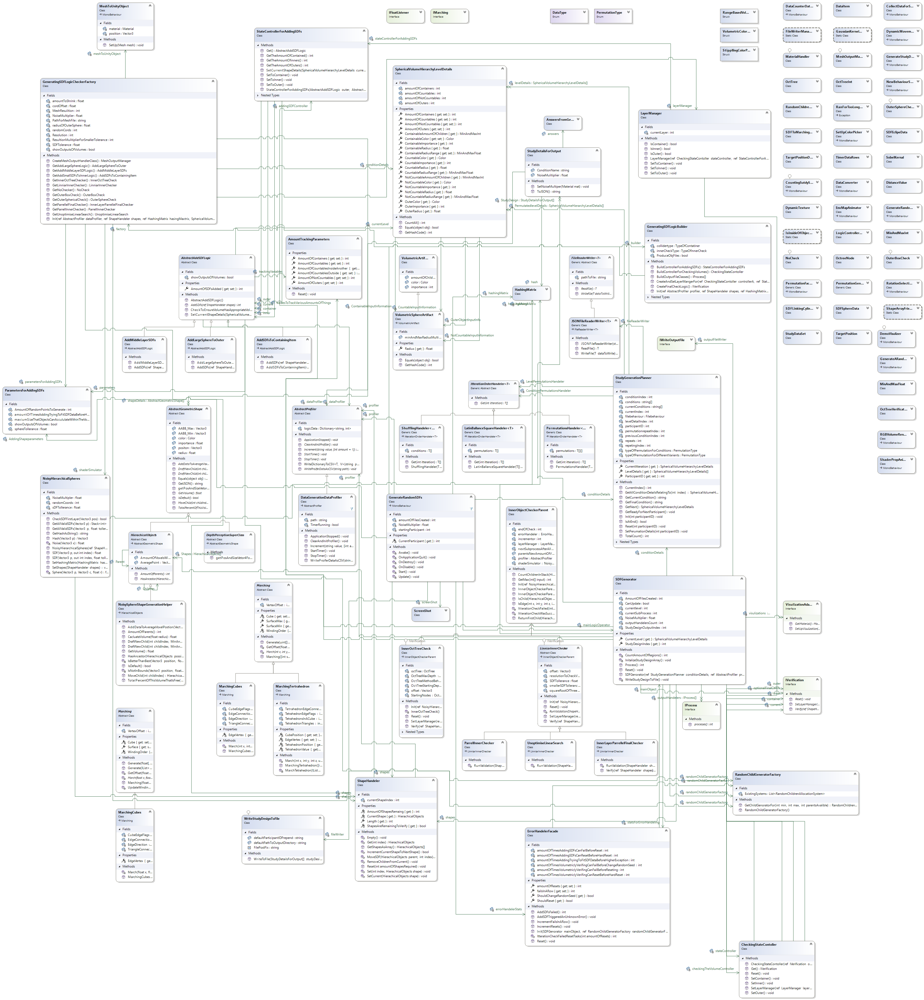

# Randomly Generating Volumes for HCI Research
A system designed to generate volumes randomly for research purposes. The paper describing it can be found at [10.1109/ISMAR-Adjunct60411.2023.00061](https://doi.org/10.1109/ISMAR-Adjunct60411.2023.00061) and was presented at ISMAR under the title "Generating Pseudo Random Volumes for Volumetric Research."

This system presents a modular approach to creating volumes randomly, tailored for Human-Computer Interaction (HCI) studies, particularly in Augmented Reality (AR) and Virtual Reality (VR) research, although it is not limited to these domains. Example code for rendering these objects is provided.

## Outputs
- **JSON Data**: Various outputs are achievable using this system. You can directly generate JSON code that facilitates user studies creation, incorporating visualization data and various answer data.
- **Interfaces**: The system includes two interfaces (desktop and Mixed Reality) intended to provide a template for conducting studies.
- **Modularity**: The entire system is designed with modularity in mind, providing flexibility for different research needs.

## System Design
This system utilizes a highly modular and adaptable modular system. Using an array of Design Patterns with a lot of inheritance. Below is an image of the main functioning class diagram showing the parts of the system that persist throughout iterations of the system.


## Citing
If you use or modify this system, please cite or link to the relevant research paper (10.1109/ISMAR-Adjunct60411.2023.00061), the BibTeX entry provided below, or link to this repository.

### Bibtex
```
@INPROCEEDINGS{10322203,
  author={Clarke, Thomas J. and Mayer, Wolfgang and Zucco, Joanne E. and Smith, Ross T.},
  booktitle={2023 IEEE International Symposium on Mixed and Augmented Reality Adjunct (ISMAR-Adjunct)}, 
  title={Generating Pseudo Random Volumes for Volumetric Research}, 
  year={2023},
  volume={},
  number={},
  pages={266-270},
  keywords={Headphones;Three-dimensional displays;Design methodology;Mixed reality;User interfaces;Augmented reality;Meteorology;Human-centered computing;Visualization;Visualization techniques;Treemaps;Visualization design and evaluation methods},
  doi={10.1109/ISMAR-Adjunct60411.2023.00061}}
```
